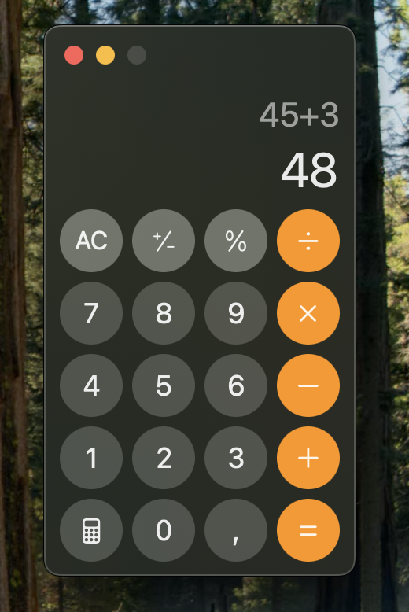

# 🧮 Clone da Calculadora do macOS (MacBook M1)

Este projeto é um **clone funcional da calculadora nativa do macOS (MacBook M1)**, desenvolvido com o objetivo de **testar e demonstrar minhas habilidades em Flutter** e reforçar conceitos de **lógica de programação**.

## 🎯 Objetivo

Criar uma interface fiel à calculadora do Mac, com comportamento responsivo e operações básicas funcionando corretamente, como:
- Adição (+)
- Subtração (−)
- Multiplicação (×)
- Divisão (÷)
- Limpar (AC)
- Apagar último dígito (⌫)
- Igual (=)

## 🛠️ Tecnologias Utilizadas

- [Flutter](https://flutter.dev/) (100% em Dart)
- [FontAwesome Flutter](https://pub.dev/packages/font_awesome_flutter)
- Layout responsivo com `MediaQuery` e `Expanded`
- Avaliação de expressões com a lib [`expressions`](https://pub.dev/packages/expressions)

## ✨ Funcionalidades

- Layout inspirado na calculadora do macOS
- Digitação fluida de números e operadores
- Avaliação de expressões em tempo real
- Controle de estados com `setState`
- Exibição dinâmica no display com controle de overflow e alinhamento
- Ícones animados e interação visual com `InkWell`

## 💻 Captura de Tela / Vídeo



## 📂 Estrutura do Projeto

```text
lib/
├── components/
│ ├── BuildOperators.dart
│ ├── BuildNumbers.dart
├── utils/
│ ├── AppColors.dart
├── main.dart
```